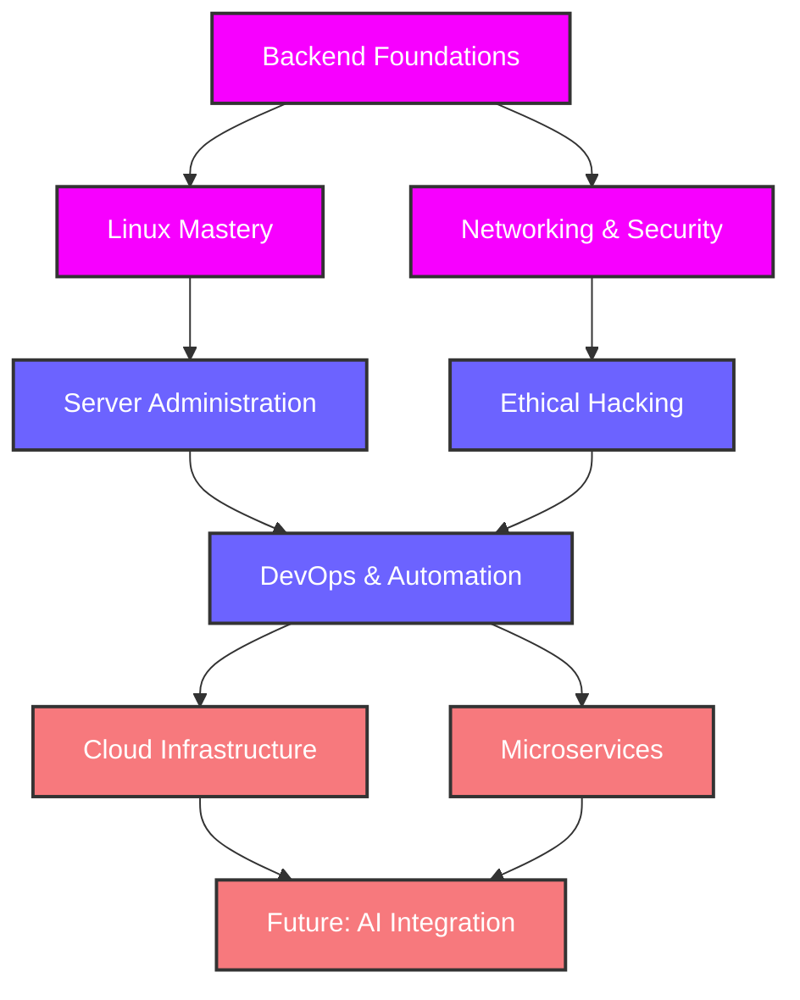

<div align="center">
  
</div>

<div align="center">
  
</div>

<div align="center">
  
</div>

<!-- Separador animado -->


<p align="center">
  
  
  
  
</p>

<div align="center">
  <a href="#"></a>
</div>

<div align="center">
  
</div>

# 💼 Currículum Técnico

<div align="center">
  
</div>

## 👨‍💻 Sobre mí

<table>
<tr>
<td width="60%">
<div style="text-align: center;">

```typescript
const holly = {
  rol: "Desarrollador Backend & Linux Enthusiast",
  experiencia: "Transformador de café en código",
  especialidades: ["Backend", "Linux", "Automatización", "Redes"],
  hobbies: ["Hacking ético", "CTFs", "Virtualización con VMware"],
  pasión: "Crear sistemas que funcionen sin que nadie sepa cómo",
  superpoder: "Sobrevivir con solo terminal, sin interfaces gráficas",
  kryptonita: "CSS y diseño frontend en general",
  filosofía: "Si el código no tiene al menos tres chistes dentro, ¿de verdad es código?"
};
```

</div>
</td>
<td width="40%">
<div align="center">
  
  <br><br>
  
</div>
</td>
</tr>
</table>

<p align="center">Desarrollador multiplataforma con alma de sysadmin y corazón de hacker. Especializado en backend y con una relación de odio-más odio con el frontend. Capaz de sobrevivir con solo una terminal y un editor de texto. La única vez que abrí Photoshop acabé formateando el ordenador... por si acaso. Experto en transformar requisitos ambiguos en soluciones funcionales y en encontrar bugs donde ni el QA más experimentado miraría.</p>

<div align="center">
  
</div>

<!-- Separador animado -->


## 🚀 Habilidades Técnicas

<div align="center">
  
</div>

```javascript
// developer.js - Un vistazo a mi perfil técnico
const hollyPerfil = {
    code: ["Java", "Python", "JavaScript", "PHP", "Bash", "HTML/CSS"],
    askMeAbout: ["backend", "linux", "cyberseguridad", "automatización", "café ☕"],
    technologies: {
        frontEnd: {
            js: ["React", "VanillaJS", "Vite"],
            css: ["Tailwind", "Bootstrap", "CSS3"]
        },
        backEnd: {
            java: ["Spring Boot", "JPA/Hibernate"],
            python: ["Flask", "Django", "Automations"],
            js: ["Node.js", "Express"]
        },
        devOps: ["Docker", "Kubernetes", "AWS", "CI/CD"],
        security: ["Kali Linux", "Pentesting", "OWASP", "Reverse Engineering"],
        databases: ["MySQL", "PostgreSQL", "MongoDB", "Redis"],
        tools: ["Git", "Bash", "Vim", "Wireshark", "Metasploit"]
    },
    currentlyLearning: ["Microservicios", "Terraform", "AWS", "Go"],
    funFact: "Las dos reglas para el éxito en programación: 1) Nunca reveles todo lo que sabes, 2) ..."
};
```

### Distribución de Tecnologías
<div align="center">
  
</div>

<div align="center">
  
</div>

<div style="display: flex; justify-content: center;">
  <div style="margin: 10px; border-radius: 10px; overflow: hidden; box-shadow: 0 4px 8px rgba(0,0,0,0.1); background: linear-gradient(135deg, rgba(255,255,255,0.1), rgba(255,255,255,0));">
    
  </div>
</div>

<div align="center">

| Lenguajes & Backend | Sistemas & Redes | Hobbies Técnicos | Herramientas & Otros |
|-------------------|-----------------------|----------------|----------------------|
|     |     |     |    |

</div>

<!-- Nuevas tecnologías añadidas -->
<div align="center">

| Frontend | Herramientas de Desarrollo | 
|-------------------|----------------------|
|    |   |

</div>

<div align="center">
  
  
  
</div>

<details>
  <summary><b>🔥 Ver más habilidades (y carencias) ↴</b></summary>

  ### 🧠 Paradigmas y metodologías
  - **Programación Orientada a Objetos**: Porque los objetos son amigos, no comida
  - **Arquitectura MVC**: Separando responsabilidades como un profesional
  - **RESTful APIs**: Comunicando servicios como si fueran personas civilizadas
  - **Desarrollo Ágil**: O lo que sea que hagamos cuando el deadline se acerca y el pánico aumenta
  - **Pentesting**: Solo como hobby, no lo suficiente para hackear la NASA (todavía)

  ### 🖥️ Sistemas operativos
  - 
  -  
  - 
  -  (cuando no hay más remedio)

  ### 🛠️ Herramientas adicionales
  - 
  - 
  -  (porque salir de Vim es el verdadero reto)
  - 
  
  ### 📊 Distribución porcentual por categoría
  - **Desarrollo backend**: ~50% (donde realmente disfruto)
  - **Sistemas Linux y redes**: ~35% (mi zona de confort)
  - **Cybersecurity y pentesting**: ~14% (hobby que se me da bastante bien)
  - **Frontend**: ~1% (y probablemente sea un botón mal centrado)
</details>

<!-- Separador animado -->


## 📈 Estadísticas en Tiempo Real

<div align="center">
  
</div>

<div align="center">
  <p>Donde los números cuentan historias (o al menos, eso es lo que le digo a mi jefe)</p>
</div>

<div align="center">
  
  
</div>

<div align="center">
  <a href="https://github.com/hollyredfield">
    
  </a>
</div>

<div align="center">
  
</div>

<div align="center">
  
</div>

<div align="center">
  
</div>

<!-- Separador animado -->


## 🏆 Experiencia Destacada

<div align="center">
  
</div>

<div align="center">
  
</div>

<div align="center">
  
</div>

<!-- Mejora de proyectos con showcase visual -->
<div align="center">
  <table>
    <tr>
      <td width="50%">
        <h3 align="center">🔒 Web Scraping con Playwright</h3>
        <div align="center">
          <a href="https://github.com/hollyredfield/web-scraper-project" target="_blank">
            
          </a>
          <p>
            <strong>Extracción de datos web a lo ninja</strong> - Automatización avanzada para recolectar datos estructurados de diversas fuentes web.
          </p>
        </div>
      </td>
      <td width="50%">
        <h3 align="center">🌐 Sistema de API REST</h3>
        <div align="center">
          <a href="https://github.com/hollyredfield/api-rest-project" target="_blank">
            
          </a>
          <p>
            <strong>Servicios web con más endpoints que usuarios</strong> - Desarrollo de APIs RESTful con arquitectura escalable y documentación Swagger.
          </p>
        </div>
      </td>
    </tr>
    <tr>
      <td width="50%">
        <h3 align="center">💰 Sistema Bancario Java</h3>
        <div align="center">
          <a href="https://github.com/hollyredfield/bank-system-java" target="_blank">
            
          </a>
          <p>
            <strong>Gestión financiera multicapa</strong> - Implementación robusta donde solo los logs de errores son consistentes.
          </p>
        </div>
      </td>
      <td width="50%">
        <h3 align="center">📚 Biblioteca Virtual</h3>
        <div align="center">
          <a href="https://github.com/hollyredfield/virtual-library" target="_blank">
            
          </a>
          <p>
            <strong>Cliente-servidor para gestión de libros</strong> - Porque las librerías físicas son muy mainstream.
          </p>
        </div>
      </td>
    </tr>
  </table>
</div>

### 🐧 Linux & Sistemas
- **Administración de Servidores Linux**: Configuración de servidores que solo yo entiendo cómo funcionan.
- **Containerización con Docker**: Empaquetando aplicaciones para que funcionen en todas partes (excepto en producción).
- **Redes Cisco**: Configuración de la infraestructura donde luego pierdo la conexión.
- **Automatización de Sistemas**: Scripts para gestionar entornos Linux y ahorrarme trabajo (que luego gasto depurando los scripts).

### 🌐 Desarrollo Backend
- **Web Scraping con Playwright**: Extracción de datos web a lo ninja, porque copiar y pegar es para débiles.
- **API REST**: Desarrollo de servicios web con más endpoints que usuarios.
- **Sistema Bancario Java**: Gestión financiera con arquitectura multicapa donde la única capa que funciona es la de errores.
- **Sistemas de Reporting**: Generación automática de informes que nadie lee pero todos piden.

### 💾 Persistencia y Gestión de Datos
- **Biblioteca Virtual**: Cliente-servidor para gestión de libros, porque las librerías físicas son muy mainstream.
- **Sistemas de Gestión Empresarial**: Implementación de sistemas que sustituyen al Excel que todos seguirán usando.
- **Gestión de Inventarios con Java Swing**: Interfaces que parecen de los 90, pero hey, funcionan.

<details>
  <summary><b>👾 Ver mi laboratorio secreto de experimentos...</b></summary>

  ### 🧪 Experimentos y laboratorios
  - **Infraestructura personal**: Con más cables y servidores de los que cualquier persona normal debería tener.
  - **Clústeres de Raspberry Pi**: Porque un ordenador no es suficiente para calentar la habitación en invierno.
  - **Redes segmentadas**: Para separar mis dispositivos de los que hackeo "con fines educativos".
  
  ### 🔧 Herramientas que he intentado dominar
  - **Análisis de Memoria**: Volatility y amigos, para cuando necesitas saber qué estaba haciendo ese malware.
  - **Escaneo de Redes**: NMAP y similares, porque conocer tu red es el primer paso para perder horas de tu vida.
  - **Desarrollo de Scripts**: Automatizando tareas para ganar tiempo que luego pierdo programando la automatización.
</details>

<div align="center">
  
</div>

<!-- Separador animado -->


## 🎓 Formación

<div align="center">
  
</div>

<div align="center">
  
</div>

<div align="center">
  
  <b>Técnico Superior en Desarrollo de Aplicaciones Multiplataforma (DAM)</b>
</div>

<table align="center">
  <tr>
    <td align="center">
      <b>Primer Curso (DAM1)</b><br>
      • Fundamentos de programación (Python básico)<br>
      • Lenguajes de marcas (HTML, CSS básico)<br>
      • Bases de datos relacionales (diagramas E-R)<br>
      • Programación orientada a objetos inicial (Java)<br>
      • PHP básico
    </td>
    <td align="center">
      <b>Segundo Curso (DAM2)</b><br>
      • Acceso a datos avanzado (persistencia, JDBC)<br>
      • Programación de servicios y procesos<br>
      • Sistemas de gestión empresarial<br>
      • Programación multimedia y dispositivos móviles<br>
      • Desarrollo de interfaces (mi pesadilla)
    </td>
  </tr>
</table>

<div align="center">
  <i>Donde aprendí que programar no es solo escribir código, sino también buscar en Stack Overflow y que el terminal es mejor amigo que cualquier IDE gráfico.</i>
</div>

<div align="center">
  
</div>

<!-- Separador animado -->


## 🧠 Metodologías y Filosofía

<div align="center">
  
</div>

<div style="background: linear-gradient(to right, #12c2e9, #c471ed, #f7797d); margin: 20px auto; border-radius: 10px; padding: 20px; color: white; width: 80%; text-align: center;">
  <h3 style="margin: 0;">Dogmas Inquebrantables del Código</h3>
</div>

<!-- Añadido diagrama Mermaid de ruta de desarrollo -->


<div align="center">
  <p><i>💡 Tip de desarrollador: "Si funciona en desarrollo, funcionará en producción... dijo nadie nunca."</i></p>
</div>

- **Backend sobre Frontend**: Porque las APIs bien diseñadas son más bonitas que cualquier interfaz gráfica.
- **Terminal sobre GUI**: La línea de comandos es mi Picasso, donde un simple comando hace magia.
- **Vim sobre Nano**: Porque salir de Vim es un logro que pongo en mi currículum.
- **80 caracteres por línea**: Si tu código necesita más, probablemente necesites refactorizar (o comprar un monitor más grande).
- **Tabs vs Spaces**: Un tema sobre el que he perdido amistades y relaciones.
- **Git sobre SVN**: Porque los commit son como checkpoints en un videojuego difícil.
- **Linux sobre Windows**: Windows es solo para jugar; el trabajo serio se hace en una terminal negra.
- **Cafe > Energética > Té > Agua > Dormir**: Mi pirámide nutricional para programar.

<details>
  <summary><b>🧙‍♂️ Secretos del oficio</b></summary>

  - **Desarrollo Incremental**: Hacer pequeños cambios y probar, porque debuggear 1000 líneas de una vez es para masoquistas.
  - **Prototipado Rápido**: Para tener algo funcional antes de que el cliente cambie de opinión por decimoquinta vez.
  - **Desarrollo Basado en Componentes**: Porque reutilizar código es casi tan satisfactorio como resolver un bug imposible.
  - **Integración Continua**: Para que el código se rompa automáticamente, sin necesidad de hacerlo yo manualmente.
  - **Seguridad desde el Diseño**: Porque añadir seguridad al final es como poner un candado a una puerta ya forzada.
  - **Comentarios en el código**: Al principio escribes código y comentarios; con experiencia, escribes código que no necesita comentarios (pero los pones igual porque sabes que lo olvidarás todo en 3 días).
</details>

<!-- Separador animado -->


## 📬 Contacto

<!-- Mejorado el diseño de contacto con layout de tabla -->
<div align="center">
  <table width="100%">
    <tr>
      <td width="50%" align="center">
        
      </td>
      <td width="50%">
        <h3>¡Conectemos!</h3>
        <p>¿Quieres hablar de código, Linux o por qué el café es mejor que el sueño? ¿Tienes un proyecto interesante o quieres colaborar? ¡No dudes en contactarme!</p>
        <div align="center">
          <a href="mailto:tucorreo@ejemplo.com">
            
          </a>
          <a href="https://www.linkedin.com/in/tuusuario/">
            
          </a>
          <a href="https://github.com/hollyredfield">
            
          </a>
        </div>
      </td>
    </tr>
  </table>
</div>

<div align="center">
  <a href="https://github.com/hollyredfield?tab=repositories">
    
  </a>
</div>

<!-- Separador animado -->


<div align="center">
  
</div>

<!-- Contador de visitas mejorado -->
<div align="center">
  <h3>👁️ Visitas al Perfil</h3>
  
  
</div>

<div align="center">
  
  <p>¿Has llegado hasta aquí? ¡Mereces un café! ☕ Yo me tomaré otro mientras tanto.</p>
  
  
</div>

<div align="center">
  
</div>
