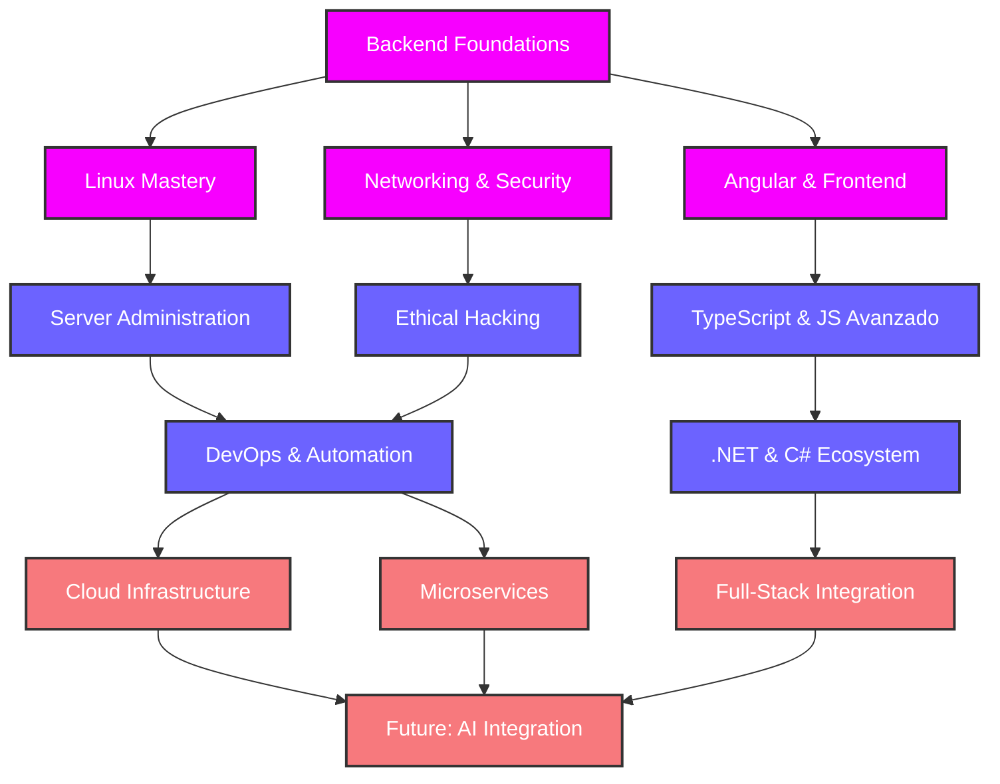

<div align="center">
  
</div>

<div align="center">
  
</div>

<div align="center">
  
</div>

<!-- Separador animado -->


<p align="center">
  
  
  
  
</p>

<div align="center">
  <a href="#"></a>
</div>

<div align="center">
  
</div>

# 💼 Currículum Técnico

<div align="center">
  
</div>

## 👨‍💻 Sobre mí

<table>
<tr>
<td width="60%">
<div style="text-align: center;">

```typescript
const holly = {
  rol: "Desarrollador Backend & Linux Enthusiast",
  experiencia: "Transformador de café en código",
  especialidades: ["Backend", "Linux", "Automatización", "Redes"],
  hobbies: ["Hacking ético", "CTFs", "Virtualización con VMware"],
  pasión: "Crear sistemas que funcionen sin que nadie sepa cómo",
  superpoder: "Sobrevivir con solo terminal, sin interfaces gráficas",
  kryptonita: "CSS y diseño frontend en general",
  filosofía: "Si el código no tiene al menos tres chistes dentro, ¿de verdad es código?"
};
```

</div>
</td>
<td width="40%">
<div align="center">
  
  <br><br>
  
</div>
</td>
</tr>
</table>

<p align="center">Desarrollador multiplataforma con alma de sysadmin y corazón de hacker. Especializado en backend y con una relación de odio-más odio con el frontend. Capaz de sobrevivir con solo una terminal y un editor de texto. La única vez que abrí Photoshop acabé formateando el ordenador... por si acaso. Experto en transformar requisitos ambiguos en soluciones funcionales y en encontrar bugs donde ni el QA más experimentado miraría.</p>

<div align="center">
  
</div>

<!-- Separador animado -->


## 🚀 Habilidades Técnicas

<div align="center">
  
</div>

```javascript
// developer.js - Un vistazo a mi perfil técnico
const hollyPerfil = {
    code: ["Java", "Python", "JavaScript", "PHP", "Bash", "HTML/CSS", "TypeScript", "C#", "C++", "Kotlin", "PowerShell", "Visual Basic"],
    askMeAbout: ["backend", "linux", "cyberseguridad", "automatización", "café ☕"],
    technologies: {
        frontEnd: {
            js: ["React", "VanillaJS", "Vite", "Angular"],
            css: ["Tailwind", "Bootstrap", "CSS3"]
        },
        backEnd: {
            java: ["Spring Boot", "JPA/Hibernate"],
            python: ["Flask", "Django", "Automations"],
            js: ["Node.js", "Express"],
            dotnet: [".NET Core", "ASP.NET"]
        },
        devOps: ["Docker", "Kubernetes", "AWS", "CI/CD"],
        security: ["Kali Linux", "Pentesting", "OWASP", "Reverse Engineering"],
        databases: ["MySQL", "PostgreSQL", "MongoDB", "Redis"],
        tools: ["Git", "Bash", "Vim", "Wireshark", "Metasploit", "VS Code", "IntelliJ IDEA", "PyCharm", "NetBeans", "Atom", "Eclipse", "Proton", "Salesforce"]
    },
    currentlyLearning: ["Microservicios", "Terraform", "AWS", "Go"],
    funFact: "Las dos reglas para el éxito en programación: 1) Nunca reveles todo lo que sabes, 2) ..."
};
```

### Distribución de Tecnologías
<div align="center">
  
</div>

<div align="center">

| Lenguajes & Backend | Sistemas & Redes | Hobbies Técnicos | Herramientas & Otros |
|-------------------|-----------------------|----------------|----------------------|
|     |     |     |    |

</div>

<!-- Nuevas tecnologías añadidas -->
<div align="center">

| Frontend | Backend & Frameworks | 
|-------------------|----------------------|
|     |    |

</div>

<div align="center">

| Lenguajes Adicionales | IDEs & Herramientas | 
|-------------------|----------------------|
|      |         |

</div>

<div align="center">
  
  
  
</div>

<div align="center">
  
</div>

<!-- Separador animado -->


## 🧠 Metodologías y Filosofía

<div align="center">
  
</div>

<div style="background: linear-gradient(to right, #12c2e9, #c471ed, #f7797d); margin: 20px auto; border-radius: 10px; padding: 20px; color: white; width: 80%; text-align: center;">
  <h3 style="margin: 0;">Dogmas Inquebrantables del Código</h3>
</div>

<!-- Añadido diagrama Mermaid de ruta de desarrollo -->


<div align="center">
  <p><i>💡 Tip de desarrollador: "Si funciona en desarrollo, funcionará en producción... dijo nadie nunca."</i></p>
</div>

<!-- Separador animado -->


## 📬 Contacto

<div align="center">
  <table width="100%">
    <tr>
      <td width="50%" align="center">
        
      </td>
      <td width="50%">
        <h3>¡Conectemos!</h3>
        <p>¿Quieres hablar de código, Linux o por qué el café es mejor que el sueño? ¿Tienes un proyecto interesante o quieres colaborar? ¡No dudes en contactarme!</p>
        <div align="center">
          <a href="mailto:tucorreo@ejemplo.com">
            
          </a>
          <a href="https://www.linkedin.com/in/tuusuario/">
            
          </a>
          <a href="https://github.com/hollyredfield">
            
          </a>
        </div>
      </td>
    </tr>
  </table>
</div>

<div align="center">
  <a href="https://github.com/hollyredfield?tab=repositories">
    
  </a>
</div>

<!-- Separador animado -->


<div align="center">
  
</div>

<!-- Contador de visitas mejorado -->
<div align="center">
  <h3>👁️ Visitas al Perfil</h3>
  
  
</div>

<div align="center">
  
  <p>¿Has llegado hasta aquí? ¡Mereces un café! ☕ Yo me tomaré otro mientras tanto.</p>
  
  
</div>

<div align="center">
  
</div>
