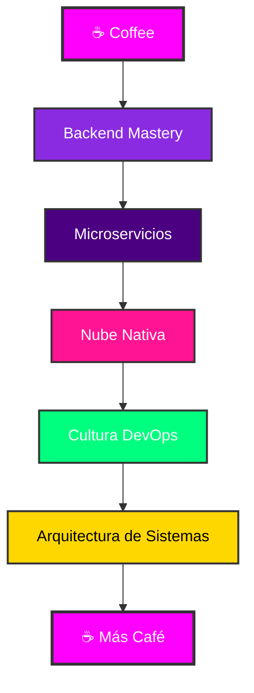

<div align="center">
  <!-- Epic Header with Neon Effect -->
  
</div>

<div align="center">
  <!-- Dynamic typing animation with tech stack -->
  
</div>

<div align="center">
  <!-- Coffee Philosophy Animation -->
  
</div>

<!-- Epic Stats Banner -->
<p align="center">
  
  
  
  
</p>

<div align="center">
  
</div>

---

## 🎯 **MISSION CONTROL** 

<table width="100%" align="center">
<tr>
<td width="50%" align="center">

### 👨‍💻 **About The Developer**

```yaml
name: "Holly Redfield (Álex)"
role: "Desarrollador Backend & Full-Stack"
location: "España 🇪🇸"
status: "Preparando código con café ☕"
motto: "El código es poesía escrita en lógica"
current_focus: "Construyendo sistemas backend escalables"
learning: ["Docker Avanzado", "Microservicios", "Testing"]
```

**🔮 Philosophy:**  
*"Desarrollador que convierte requisitos difusos en soluciones elegantes. Especializado en backend, pero capaz de sobrevivir en el frontend sin destruir la UI... la mayoría de las veces."*

</td>
<td width="50%" align="center">


</td>
</tr>
</table>

---

## ⚡ **TECH ARSENAL**

<div align="center">
  
</div>

### 🔥 **Core Technologies**
<div align="center">
  
| **💻 Languages** | **🚀 Backend** | **🎨 Frontend** | **🗄️ Databases** |
|:---:|:---:|:---:|:---:|
|  |  |  |  |
|  |  |  |  |
|  |  |  |  |
|  |  |  | — |
|  | — |  | — |

</div>

### 🛠️ **Development Arsenal**
<div align="center">

| **⚙️ Tools & DevOps** | **🎮 Platforms & Others** |
|:---:|:---:|
|    |    |
|    |    |

</div>

### 📊 **GitHub Analytics**
<div align="center">
  
  
</div>

<div align="center">
  
</div>

---

## 🏆 **PROJECT SHOWCASE**

<div align="center">
  
</div>

<div align="center">
  
</div>

<table width="100%">
<tr>
<td width="50%" align="center">

### 🕷️ **Web Scraping Engine**
<div align="center">
<a href="https://github.com/hollyredfield/web-scraper-project">

</a>
</div>

**🎯 Mission:** *Extracción de datos web ninja-style*  
**⚡ Tech:** Python, Playwright, BeautifulSoup  
**🔥 Features:** Anti-detection, proxy rotation, data cleaning

</td>
<td width="50%" align="center">

### 🌐 **REST API Fortress**
<div align="center">
<a href="https://github.com/hollyredfield/api-rest-project">

</a>
</div>

**🎯 Mission:** *APIs más robustas que un Nokia 3310*  
**⚡ Tech:** Java, SpringBoot, PostgreSQL  
**🔥 Features:** JWT Auth, Swagger docs, rate limiting

</td>
</tr>
<tr>
<td width="50%" align="center">

### 💰 **Banking System Core**
<div align="center">
<a href="https://github.com/hollyredfield/bank-system-java">

</a>
</div>

**🎯 Mission:** *Sistema bancario multicapa*  
**⚡ Tech:** Java, Spring Security, MySQL  
**🔥 Features:** Transacciones ACID, logging completo

</td>
<td width="50%" align="center">

### 📚 **Virtual Library Hub**
<div align="center">
<a href="https://github.com/hollyredfield/virtual-library">

</a>
</div>

**🎯 Mission:** *Gestión de libros cliente-servidor*  
**⚡ Tech:** Java, Socket Programming, Swing  
**🔥 Features:** Multi-threading, real-time sync

</td>
</tr>
</table>

---

## 🧠 **DEVELOPMENT PHILOSOPHY**

<div align="center">
  
</div>

<div align="center">
  
  
  
  
</div>

### 🎨 **Code Principles**
```javascript
const developerMindset = {
    architecture: "Clean, scalable, maintainable",
    testing: "If it's not tested, it doesn't work",
    documentation: "Code tells you HOW, comments tell you WHY",
    performance: "Fast is good, correct is better",
    security: "Paranoid by design, secure by default",
    learning: "Stay curious, stay hungry",
    coffee: "The fuel of innovation ☕"
};
```

### 🛤️ **Learning Roadmap**


### 💭 **Development Principles**

<div align="center">
  <p><i>💡 Tip de desarrollador: "Si funciona en desarrollo, funcionará en producción... dijo nadie nunca."</i></p>
</div>

- **Backend sobre Frontend**: Porque las APIs bien diseñadas son más bonitas que cualquier interfaz gráfica.
- **Terminal sobre GUI**: La línea de comandos es mi Picasso, donde un simple comando hace magia.
- **Vim sobre Nano**: Porque salir de Vim es un logro que pongo en mi currículum.
- **80 caracteres por línea**: Si tu código necesita más, probablemente necesite refactorizar (o comprar un monitor más grande).
- **Tabs vs Spaces**: Un tema sobre el que he perdido amistades y relaciones.
- **Git sobre SVN**: Porque los commit son como checkpoints en un videojuego difícil.
- **Windows y Linux**: Uso ambos según el proyecto y la necesidad.
- **Cafe > Energética > Té > Agua > Dormir**: Mi pirámide nutricional para programar.

<details>
  <summary><b>🧙‍♂️ Secretos del oficio</b></summary>

- **Desarrollo Incremental**: Hacer pequeños cambios y probar, porque debuggear 1000 líneas de una vez es para masoquistas.
- **Prototipado Rápido**: Para tener algo funcional antes de que el cliente cambie de opinión por decimoquinta vez.
- **Desarrollo Basado en Componentes**: Porque reutilizar código es casi tan satisfactorio como resolver un bug imposible.
- **Integración Continua**: Para que el código se rompa automáticamente, sin necesidad de hacerlo yo manualmente.
- **Seguridad desde el Diseño**: Porque añadir seguridad al final es como poner un candado a una puerta ya forzada.
- **Comentarios en el código**: Al principio escribes código y comentarios; con experiencia, escribes código que no necesita comentarios (pero los pones igual porque sabes que lo olvidarás todo en 3 días).

</details>

<!-- Separador animado -->


## 📬 Contacto Adicional

<div align="center">
  <table width="100%">
    <tr>
      <td width="50%" align="center">
        
      </td>
      <td width="50%">
        <h3>¡Conectemos!</h3>
        <p>¿Quieres hablar de código, Linux o por qué el café es mejor que el sueño? ¿Tienes un proyecto interesante o quieres colaborar? ¡No dudes en contactarme!</p>
        <div align="center">
          <a href="mailto:alexdesantiagovicente@gmail.com">
            
          </a>
          <a href="https://discord.com/users/HollyRedField#9412">
            
          </a>
          <a href="https://www.linkedin.com/in/%C3%A1lex-d-4b454a374/">
            
          </a>
          <a href="https://github.com/hollyredfield">
            
          </a>
        </div>
      </td>
    </tr>
  </table>
</div>

<div align="center">
  <a href="https://github.com/hollyredfield?tab=repositories">
    
  </a>
</div>

<!-- Separador animado -->


<div align="center">
  
</div>

<!-- Contador de visitas -->
<div align="center">
  <h3>👁️ Visitas al Perfil</h3>
  
  
</div>

<div align="center">
  
  <p>¿Has llegado hasta aquí? ¡Mereces un café! ☕ Yo me tomaré otro mientras tanto.</p>
  
  
</div>

<div align="center">
  
</div>

---

<div align="center">
  <sub><strong>🎯 "Code is like humor. When you have to explain it, it's bad." - Cory House</strong></sub>
</div>

