<div align="center">
  <!-- Epic Header with Neon Effect -->
  
</div>

<div align="center">
  <!-- Dynamic typing animation with tech stack -->
  
</div>

<div align="center">
  <!-- Coffee Philosophy Animation -->
  
</div>

<!-- Epic Stats Banner -->
<p align="center">
  
  
  
  
</p>

<div align="center">
  
</div>

---

## 🎯 **MISSION CONTROL** 

<table width="100%" align="center">
<tr>
<td width="50%" align="center">

### 👨‍💻 **About The Developer**

```yaml
name: "Holly Redfield (Álex)"
role: "Backend Specialist & Full-Stack Developer"
location: "Spain 🇪🇸"
status: "Brewing code with coffee ☕"
motto: "Code is poetry written in logic"
current_focus: "Building scalable backend systems"
learning: ["Docker Advanced", "Microservices", "Testing"]
```

**🔮 Philosophy:**  
*"Desarrollador que convierte requisitos difusos en soluciones elegantes. Especializado en backend, pero capaz de sobrevivir en el frontend sin destruir la UI... la mayoría de las veces."*

</td>
<td width="50%" align="center">


</td>
</tr>
</table>

---

## ⚡ **TECH ARSENAL**

<div align="center">
  
</div>

### 🔥 **Core Technologies**
<div align="center">
  
| **💻 Languages** | **🚀 Backend** | **🎨 Frontend** | **🗄️ Databases** |
|:---:|:---:|:---:|:---:|
|  |  |  |  |
|  |  |  |  |
|  |  |  |  |
|  |  |  | — |
|  | — |  | — |

</div>

### 🛠️ **Development Arsenal**
<div align="center">

| **⚙️ Tools & DevOps** | **🎮 Platforms & Others** |
|:---:|:---:|
|    |    |
|    |    |

</div>

### 📊 **GitHub Analytics**
<div align="center">
  
  
</div>

<div align="center">
  
</div>

---

## 🏆 **PROJECT SHOWCASE**

<div align="center">
  
</div>

<div align="center">
  
</div>

<table width="100%">
<tr>
<td width="50%" align="center">

### 🕷️ **Web Scraping Engine**
<div align="center">
<a href="https://github.com/hollyredfield/web-scraper-project">

</a>
</div>

**🎯 Mission:** *Extracción de datos web ninja-style*  
**⚡ Tech:** Python, Playwright, BeautifulSoup  
**🔥 Features:** Anti-detection, proxy rotation, data cleaning

</td>
<td width="50%" align="center">

### 🌐 **REST API Fortress**
<div align="center">
<a href="https://github.com/hollyredfield/api-rest-project">

</a>
</div>

**🎯 Mission:** *APIs más robustas que un Nokia 3310*  
**⚡ Tech:** Java, SpringBoot, PostgreSQL  
**🔥 Features:** JWT Auth, Swagger docs, rate limiting

</td>
</tr>
<tr>
<td width="50%" align="center">

### 💰 **Banking System Core**
<div align="center">
<a href="https://github.com/hollyredfield/bank-system-java">

</a>
</div>

**🎯 Mission:** *Sistema bancario multicapa*  
**⚡ Tech:** Java, Spring Security, MySQL  
**🔥 Features:** Transacciones ACID, logging completo

</td>
<td width="50%" align="center">

### 📚 **Virtual Library Hub**
<div align="center">
<a href="https://github.com/hollyredfield/virtual-library">

</a>
</div>

**🎯 Mission:** *Gestión de libros cliente-servidor*  
**⚡ Tech:** Java, Socket Programming, Swing  
**🔥 Features:** Multi-threading, real-time sync

</td>
</tr>
</table>

---

## 🧠 **DEVELOPMENT PHILOSOPHY**

<div align="center">
  
</div>

<div align="center">
  
  
  
  
</div>

### 🎨 **Code Principles**
```javascript
const developerMindset = {
    architecture: "Clean, scalable, maintainable",
    testing: "If it's not tested, it doesn't work",
    documentation: "Code tells you HOW, comments tell you WHY",
    performance: "Fast is good, correct is better",
    security: "Paranoid by design, secure by default",
    learning: "Stay curious, stay hungry",
    coffee: "The fuel of innovation ☕"
};
```

### 🛤️ **Learning Roadmap**

```mermaid
graph TD
    A[☕ Coffee] --> B[Backend Mastery]
    B --> C[Microservices]
    C --> D[Cloud Native]
    D --> E[DevOps Culture]
    E --> F[System Architecture]
    F --> G[☕ More Coffee]
    
    style A fill:#FF00FF,stroke:#333,stroke-width:3px,color:#fff
    style B fill:#8A2BE2,stroke:#333,stroke-width:2px,color:#fff
    style C fill:#4B0082,stroke:#333,stroke-width:2px,color:#fff
    style D fill:#FF1493,stroke:#333,stroke-width:2px,color:#fff
    style E fill:#00FF7F,stroke:#333,stroke-width:2px,color:#fff
    style F fill:#FFD700,stroke:#333,stroke-width:2px,color:#000
    style G fill:#FF00FF,stroke:#333,stroke-width:3px,color:#fff
```


---

## 🌐 **CONNECT & COLLABORATE**

<div align="center">
  
</div>

<div align="center">
  <h2>🚀 <strong>Let's Build Something Epic Together!</strong></h2>
  <p><em>¿Tienes una idea loca? ¿Un proyecto desafiante? ¿O simplemente quieres hablar de código mientras tomamos café? ¡Conectemos!</em></p>
</div>

<div align="center">
  
[](mailto:alexdesantiagovicente@gmail.com)
[](https://www.linkedin.com/in/%C3%A1lex-d-4b454a374/)
[](https://discord.com/users/HollyRedfield#9412)
[](https://github.com/hollyredfield)

</div>

<div align="center">
  <a href="https://github.com/hollyredfield?tab=repositories">
    
  </a>
</div>

---

## 📊 **PROFILE ANALYTICS**

<div align="center">
  <h3>🔥 <strong>Battle Stats</strong></h3>
  
  
  
  
  
</div>

<div align="center">
  
</div>

---

<div align="center">
  
</div>

<div align="center">
  <h2>☕ <strong>Thanks for Visiting!</strong></h2>
  <p><em>Si has llegado hasta aquí, definitivamente mereces un café. ¡Yo me tomaré otro también! ☕</em></p>
  
  
  
  
  
</div>

<div align="center">
  
</div>

---

